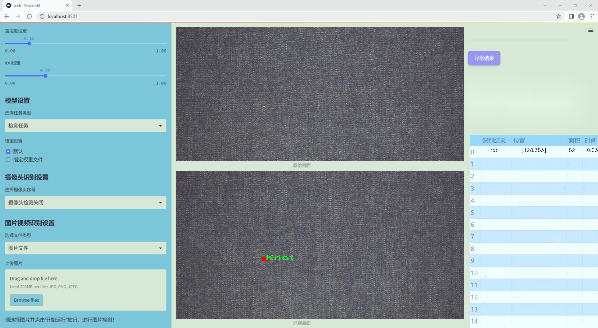
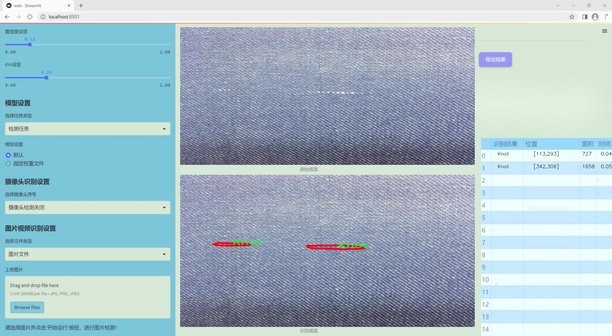
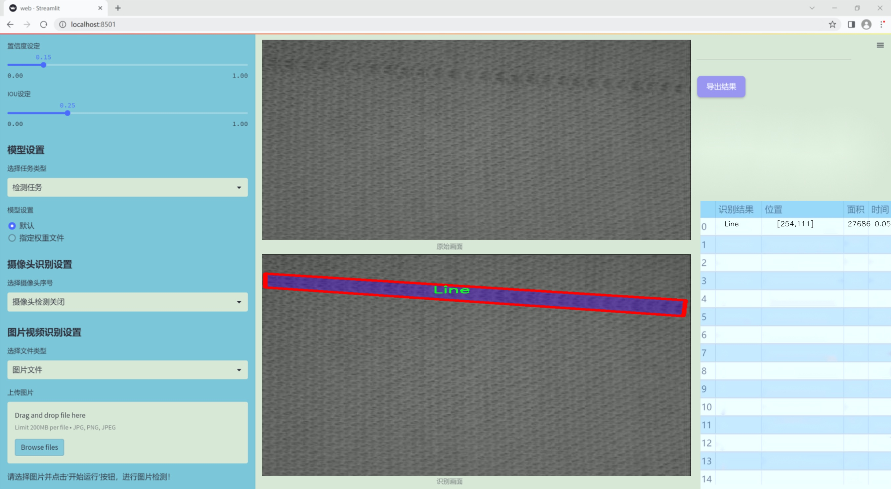
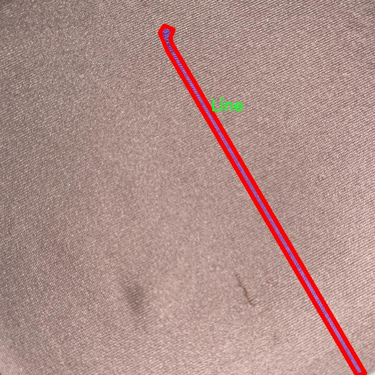
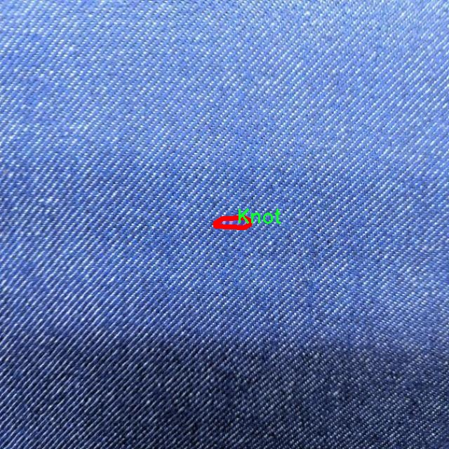
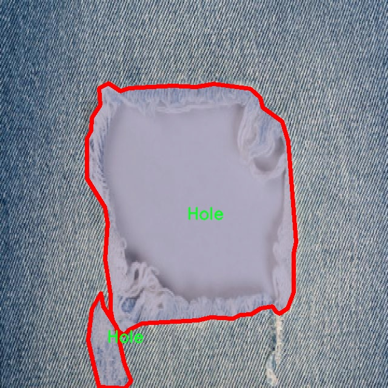

### 1.背景意义

研究背景与意义

随着纺织工业的快速发展，织物质量的控制与检测变得愈发重要。织物缺陷不仅影响产品的外观和使用性能，还可能导致经济损失和品牌形象的受损。因此，开发高效、准确的织物缺陷检测系统成为了行业亟待解决的问题。传统的人工检测方法不仅耗时耗力，而且容易受到人为因素的影响，导致检测结果的不稳定性。为此，基于计算机视觉的自动化检测技术应运而生，尤其是深度学习技术的迅猛发展，为织物缺陷检测提供了新的解决方案。

在众多深度学习模型中，YOLO（You Only Look Once）系列因其高效的实时检测能力而受到广泛关注。YOLOv11作为该系列的最新版本，具备更强的特征提取能力和更快的推理速度，适合于处理复杂的视觉任务。通过对YOLOv11进行改进，可以进一步提升其在织物缺陷检测中的性能。具体而言，本研究将聚焦于四种主要的织物缺陷类型：孔洞、结疤、线头和污渍，这些缺陷在实际生产中较为常见且对产品质量影响显著。

本项目将使用包含2500张图像的织物缺陷数据集进行训练和测试，数据集涵盖了多种缺陷类型，具有较高的代表性和实用性。通过对该数据集的深入分析和模型的优化，期望能够实现高精度的缺陷检测，并为后续的织物质量控制提供科学依据。此外，本研究还将探讨改进YOLOv11在不同缺陷类型检测中的表现差异，以期为纺织行业的智能化发展提供有力支持。通过这一研究，期望不仅能够提升织物缺陷检测的效率和准确性，还能推动计算机视觉技术在纺织领域的应用与发展。

### 2.视频效果

[2.1 视频效果](https://www.bilibili.com/video/BV19PqzYPEku/)

### 3.图片效果







##### [项目涉及的源码数据来源链接](https://kdocs.cn/l/cszuIiCKVNis)**

注意：本项目提供训练的数据集和训练教程,由于版本持续更新,暂不提供权重文件（best.pt）,请按照6.训练教程进行训练后实现上图演示的效果。

### 4.数据集信息

##### 4.1 本项目数据集类别数＆类别名

nc: 4
names: ['Hole', 'Knot', 'Line', 'Stain']


该项目为【图像分割】数据集，请在【训练教程和Web端加载模型教程（第三步）】这一步的时候按照【图像分割】部分的教程来训练

##### 4.2 本项目数据集信息介绍

本项目数据集信息介绍

本项目所使用的数据集专注于织物缺陷检测，旨在为改进YOLOv11模型提供高质量的训练样本。数据集包含四个主要类别，分别是“Hole”（孔洞）、“Knot”（结）、“Line”（线条）和“Stain”（污渍），这些类别涵盖了织物在生产和使用过程中可能出现的常见缺陷。每个类别的样本均经过精心挑选和标注，以确保数据的准确性和多样性，从而提升模型的检测能力。

在数据集的构建过程中，我们考虑了织物的多样性，包括不同材质、颜色和纹理的织物样本。这种多样性不仅有助于模型学习到不同类型缺陷的特征，还能增强其在实际应用中的泛化能力。此外，数据集中每个类别的样本数量经过合理分配，以确保模型在训练过程中能够获得均衡的学习机会，避免因某一类别样本过少而导致的偏差。

数据集的标注过程采用了严格的标准，确保每个缺陷的边界框和类别标签都准确无误。通过这种方式，我们希望能够为YOLOv11模型提供一个全面且具有挑战性的训练环境，使其能够在实际应用中有效识别和分类织物缺陷。总之，本项目的数据集不仅为模型的训练提供了坚实的基础，也为织物缺陷检测技术的进一步发展奠定了重要的基础。通过对该数据集的深入分析和应用，我们期待能够显著提升织物缺陷检测的准确性和效率，为相关行业带来更高的质量保障。









### 5.全套项目环境部署视频教程（零基础手把手教学）

[5.1 所需软件PyCharm和Anaconda安装教程（第一步）](https://www.bilibili.com/video/BV1BoC1YCEKi/?spm_id_from=333.999.0.0&vd_source=bc9aec86d164b67a7004b996143742dc)


[5.2 安装Python虚拟环境创建和依赖库安装视频教程（第二步）](https://www.bilibili.com/video/BV1ZoC1YCEBw?spm_id_from=333.788.videopod.sections&vd_source=bc9aec86d164b67a7004b996143742dc)

### 6.改进YOLOv11训练教程和Web_UI前端加载模型教程（零基础手把手教学）

[6.1 改进YOLOv11训练教程和Web_UI前端加载模型教程（第三步）](https://www.bilibili.com/video/BV1BoC1YCEhR?spm_id_from=333.788.videopod.sections&vd_source=bc9aec86d164b67a7004b996143742dc)


按照上面的训练视频教程链接加载项目提供的数据集，运行train.py即可开始训练



     Epoch   gpu_mem       box       obj       cls    labels  img_size
     1/200     20.8G   0.01576   0.01955  0.007536        22      1280: 100%|██████████| 849/849 [14:42<00:00,  1.04s/it]
               Class     Images     Labels          P          R     mAP@.5 mAP@.5:.95: 100%|██████████| 213/213 [01:14<00:00,  2.87it/s]
                 all       3395      17314      0.994      0.957      0.0957      0.0843

     Epoch   gpu_mem       box       obj       cls    labels  img_size
     2/200     20.8G   0.01578   0.01923  0.007006        22      1280: 100%|██████████| 849/849 [14:44<00:00,  1.04s/it]
               Class     Images     Labels          P          R     mAP@.5 mAP@.5:.95: 100%|██████████| 213/213 [01:12<00:00,  2.95it/s]
                 all       3395      17314      0.996      0.956      0.0957      0.0845

     Epoch   gpu_mem       box       obj       cls    labels  img_size
     3/200     20.8G   0.01561    0.0191  0.006895        27      1280: 100%|██████████| 849/849 [10:56<00:00,  1.29it/s]
               Class     Images     Labels          P          R     mAP@.5 mAP@.5:.95: 100%|███████   | 187/213 [00:52<00:00,  4.04it/s]
                 all       3395      17314      0.996      0.957      0.0957      0.0845


###### [项目数据集下载链接](https://kdocs.cn/l/cszuIiCKVNis)

### 7.原始YOLOv11算法讲解


##### YOLO11介绍

Ultralytics YOLO11是一款尖端的、最先进的模型，它在之前YOLO版本成功的基础上进行了构建，并引入了新功能和改进，以进一步提升性能和灵活性。
**YOLO11设计快速、准确且易于使用，使其成为各种物体检测和跟踪、实例分割、图像分类以及姿态估计任务的绝佳选择。**


**结构图如下：**


##### **C3k2**

**C3k2，结构图如下**


**C3k2，继承自类`C2f，其中通过c3k设置False或者Ture来决定选择使用C3k还是`**Bottleneck


**实现代码** **ultralytics/nn/modules/block.py**

##### C2PSA介绍

**借鉴V10 PSA结构，实现了C2PSA和C2fPSA，最终选择了基于C2的C2PSA（可能涨点更好？）**


**实现代码** **ultralytics/nn/modules/block.py**

##### Detect介绍

**分类检测头引入了DWConv（更加轻量级，为后续二次创新提供了改进点），结构图如下（和V8的区别）：**


### 8.200+种全套改进YOLOV11创新点原理讲解

#### 8.1 200+种全套改进YOLOV11创新点原理讲解大全

由于篇幅限制，每个创新点的具体原理讲解就不全部展开，具体见下列网址中的改进模块对应项目的技术原理博客网址【Blog】（创新点均为模块化搭建，原理适配YOLOv5~YOLOv11等各种版本）

[改进模块技术原理博客【Blog】网址链接](https://gitee.com/qunmasj/good)


#### 8.2 精选部分改进YOLOV11创新点原理讲解

###### 这里节选部分改进创新点展开原理讲解(完整的改进原理见上图和[改进模块技术原理博客链接](https://gitee.com/qunmasj/good)【如果此小节的图加载失败可以通过CSDN或者Github搜索该博客的标题访问原始博客，原始博客图片显示正常】
### FasterNet简介
神经网络在图像分类、检测和分割等各种计算机视觉任务中经历了快速发展。尽管其令人印象深刻的性能为许多应用程序提供了动力，但一个巨大的趋势是追求具有低延迟和高吞吐量的快速神经网络，以获得良好的用户体验、即时响应和安全原因等。

如何快速？研究人员和从业者不需要更昂贵的计算设备，而是倾向于设计具有成本效益的快速神经网络，降低计算复杂度，主要以浮点运算（FLOPs）的数量来衡量。

MobileNet、ShuffleNet和GhostNet等利用深度卷积（DWConv）和/或组卷积（GConv）来提取空间特征。然而，在减少FLOPs的过程中，算子经常会受到内存访问增加的副作用的影响。MicroNet进一步分解和稀疏网络，将其FLOPs推至极低水平。尽管这种方法在FLOPs方面有所改进，但其碎片计算效率很低。此外，上述网络通常伴随着额外的数据操作，如级联、Shuffle和池化，这些操作的运行时间对于小型模型来说往往很重要。

除了上述纯卷积神经网络（CNNs）之外，人们对使视觉Transformer（ViTs）和多层感知器（MLP）架构更小更快也越来越感兴趣。例如，MobileViT和MobileFormer通过将DWConv与改进的注意力机制相结合，降低了计算复杂性。然而，它们仍然受到DWConv的上述问题的困扰，并且还需要修改的注意力机制的专用硬件支持。使用先进但耗时的标准化和激活层也可能限制其在设备上的速度。

所有这些问题一起导致了以下问题：这些“快速”的神经网络真的很快吗？为了回答这个问题，作者检查了延迟和FLOPs之间的关系，这由


其中FLOPS是每秒浮点运算的缩写，作为有效计算速度的度量。虽然有许多减少FLOPs的尝试，但都很少考虑同时优化FLOPs以实现真正的低延迟。为了更好地理解这种情况，作者比较了Intel CPU上典型神经网络的FLOPS。


图中的结果表明，许多现有神经网络的FLOPS较低，其FLOPS通常低于流行的ResNet50。由于FLOPS如此之低，这些“快速”的神经网络实际上不够快。它们的FLOPs减少不能转化为延迟的确切减少量。在某些情况下，没有任何改善，甚至会导致更糟的延迟。例如，CycleMLP-B1具有ResNet50的一半FLOPs，但运行速度较慢（即CycleMLPB1与ResNet50:111.9ms与69.4ms）。

请注意，FLOPs与延迟之间的差异在之前的工作中也已被注意到，但由于它们采用了DWConv/GConv和具有低FLOPs的各种数据处理，因此部分问题仍未解决。人们认为没有更好的选择。

该博客提供的方案通过开发一种简单、快速、有效的运算符来消除这种差异，该运算符可以在减少FLOPs的情况下保持高FLOPS。

具体来说，作者重新审视了现有的操作符，特别是DWConv的计算速度——FLOPS。作者发现导致低FLOPS问题的主要原因是频繁的内存访问。然后，作者提出了PConv作为一种竞争性替代方案，它减少了计算冗余以及内存访问的数量。

图1说明了PConv的设计。它利用了特征图中的冗余，并系统地仅在一部分输入通道上应用规则卷积（Conv），而不影响其余通道。本质上，PConv的FLOPs低于常规Conv，而FLOPs高于DWConv/GConv。换句话说，PConv更好地利用了设备上的计算能力。PConv在提取空间特征方面也很有效，这在本文后面的实验中得到了验证。

作者进一步引入PConv设计了FasterNet作为一个在各种设备上运行速度非常快的新网络家族。特别是，FasterNet在分类、检测和分割任务方面实现了最先进的性能，同时具有更低的延迟和更高的吞吐量。例如，在GPU、CPU和ARM处理器上，小模型FasterNet-T0分别比MobileVitXXS快3.1倍、3.1倍和2.5倍，而在ImageNet-1k上的准确率高2.9%。大模型FasterNet-L实现了83.5%的Top-1精度，与Swin-B不相上下，同时在GPU上提供了49%的高吞吐量，在CPU上节省了42%的计算时间。

总之，贡献如下：

指出了实现更高FLOPS的重要性，而不仅仅是为了更快的神经网络而减少FLOPs。

引入了一种简单但快速且有效的卷积PConv，它很有可能取代现有的选择DWConv。

推出FasterNet，它在GPU、CPU和ARM处理器等多种设备上运行良好且普遍快速。

对各种任务进行了广泛的实验，并验证了PConv和FasterNet的高速性和有效性。

### Conv和FasterNet的设计
#### 原理

DWConv是Conv的一种流行变体，已被广泛用作许多神经网络的关键构建块。对于输入，DWConv应用个滤波器来计算输出。如图（b）所示，每个滤波器在一个输入通道上进行空间滑动，并对一个输出通道做出贡献。

与具有的FLOPs常规Conv相比，这种深度计算使得DWConv仅仅具有的FLOPs。虽然在减少FLOPs方面有效，但DWConv（通常后跟逐点卷积或PWConv）不能简单地用于替换常规Conv，因为它会导致严重的精度下降。因此，在实践中，DWConv的通道数（或网络宽度）增加到＞以补偿精度下降，例如，倒置残差块中的DWConv宽度扩展了6倍。然而，这会导致更高的内存访问，这会造成不可忽略的延迟，并降低总体计算速度，尤其是对于I/O绑定设备。特别是，内存访问的数量现在上升到


它比一个常规的Conv的值要高，即，


注意，内存访问花费在I/O操作上，这被认为已经是最小的成本，很难进一步优化。

#### PConv作为一个基本的算子


在下面演示了通过利用特征图的冗余度可以进一步优化成本。如图所示，特征图在不同通道之间具有高度相似性。许多其他著作也涵盖了这种冗余，但很少有人以简单而有效的方式充分利用它。


具体而言，作者提出了一种简单的PConv，以同时减少计算冗余和内存访问。图4中的左下角说明了PConv的工作原理。它只需在输入通道的一部分上应用常规Conv进行空间特征提取，并保持其余通道不变。对于连续或规则的内存访问，将第一个或最后一个连续的通道视为整个特征图的代表进行计算。在不丧失一般性的情况下认为输入和输出特征图具有相同数量的通道。因此，PConv的FLOPs仅


对于典型的r＝1/4 ，PConv的FLOPs只有常规Conv的1/16。此外，PConv的内存访问量较小，即：


对于r＝1/4，其仅为常规Conv的1/4。

由于只有通道用于空间特征提取，人们可能会问是否可以简单地移除剩余的（c−）通道？如果是这样，PConv将退化为具有较少通道的常规Conv，这偏离了减少冗余的目标。

请注意，保持其余通道不变，而不是从特征图中删除它们。这是因为它们对后续PWConv层有用，PWConv允许特征信息流经所有通道。

#### PConv之后是PWConv


为了充分有效地利用来自所有通道的信息，进一步将逐点卷积（PWConv）附加到PConv。它们在输入特征图上的有效感受野看起来像一个T形Conv，与均匀处理补丁的常规Conv相比，它更专注于中心位置，如图5所示。为了证明这个T形感受野的合理性，首先通过计算位置的Frobenius范数来评估每个位置的重要性。


假设，如果一个职位比其他职位具有更大的Frobenius范数，则该职位往往更重要。对于正则Conv滤波器，位置处的Frobenius范数由计算，其中。


一个显著位置是具有最大Frobenius范数的位置。然后，在预训练的ResNet18中集体检查每个过滤器，找出它们的显著位置，并绘制显著位置的直方图。图6中的结果表明，中心位置是过滤器中最常见的突出位置。换句话说，中心位置的权重比周围的更重。这与集中于中心位置的T形计算一致。

虽然T形卷积可以直接用于高效计算，但作者表明，将T形卷积分解为PConv和PWConv更好，因为该分解利用了滤波器间冗余并进一步节省了FLOPs。对于相同的输入和输出，T形Conv的FLOPs可以计算为:


它高于PConv和PWConv的流量，即：


其中和（例如，当时）。此外，可以很容易地利用常规Conv进行两步实现。

# FasterNet作为Backbone
鉴于新型PConv和现成的PWConv作为主要的算子，进一步提出FasterNet，这是一个新的神经网络家族，运行速度非常快，对许多视觉任务非常有效。目标是使体系结构尽可能简单，使其总体上对硬件友好。


在图中展示了整体架构。它有4个层次级，每个层次级前面都有一个嵌入层（步长为4的常规4×4卷积）或一个合并层（步长为2的常规2×2卷积），用于空间下采样和通道数量扩展。每个阶段都有一堆FasterNet块。作者观察到，最后两个阶段中的块消耗更少的内存访问，并且倾向于具有更高的FLOPS，如表1中的经验验证。因此，放置了更多FasterNet块，并相应地将更多计算分配给最后两个阶段。每个FasterNet块有一个PConv层，后跟2个PWConv（或Conv 1×1）层。它们一起显示为倒置残差块，其中中间层具有扩展的通道数量，并且放置了Shorcut以重用输入特征。

除了上述算子，标准化和激活层对于高性能神经网络也是不可或缺的。然而，许多先前的工作在整个网络中过度使用这些层，这可能会限制特征多样性，从而损害性能。它还可以降低整体计算速度。相比之下，只将它们放在每个中间PWConv之后，以保持特征多样性并实现较低的延迟。

此外，使用批次归一化（BN）代替其他替代方法。BN的优点是，它可以合并到其相邻的Conv层中，以便更快地进行推断，同时与其他层一样有效。对于激活层，根据经验选择了GELU用于较小的FasterNet变体，而ReLU用于较大的FasterNet变体，同时考虑了运行时间和有效性。最后三个层，即全局平均池化、卷积1×1和全连接层，一起用于特征转换和分类。

为了在不同的计算预算下提供广泛的应用，提供FasterNet的Tiny模型、Small模型、Medium模型和Big模型变体，分别称为FasterNetT0/1/2、FasterNet-S、FasterNet-M和FasterNet-L。它们具有相似的结构，但深度和宽度不同。

架构规范如下：


### 9.系统功能展示

图9.1.系统支持检测结果表格显示

  图9.2.系统支持置信度和IOU阈值手动调节

  图9.3.系统支持自定义加载权重文件best.pt(需要你通过步骤5中训练获得)

  图9.4.系统支持摄像头实时识别

  图9.5.系统支持图片识别

  图9.6.系统支持视频识别

  图9.7.系统支持识别结果文件自动保存

  图9.8.系统支持Excel导出检测结果数据


### 10. YOLOv11核心改进源码讲解

#### 10.1 mobilenetv4.py

以下是对代码的逐文件分析和核心部分的保留，并添加了详细的中文注释：

```python
from typing import Any, Callable, Dict, List, Mapping, Optional, Tuple, Union
import torch
import torch.nn as nn

# 定义可导出的模型名称
__all__ = ['MobileNetV4ConvSmall', 'MobileNetV4ConvMedium', 'MobileNetV4ConvLarge', 'MobileNetV4HybridMedium', 'MobileNetV4HybridLarge']

# 定义不同规模的 MobileNetV4 模型的结构参数
MNV4ConvSmall_BLOCK_SPECS = {
    "conv0": {
        "block_name": "convbn",
        "num_blocks": 1,
        "block_specs": [
            [3, 32, 3, 2]  # 输入通道数、输出通道数、卷积核大小、步幅
        ]
    },
    # 其他层的结构省略
}

# 定义 make_divisible 函数，用于确保通道数是8的倍数
def make_divisible(value: float, divisor: int, min_value: Optional[float] = None, round_down_protect: bool = True) -> int:
    """
    确保所有层的通道数是可被 divisor 整除的。

    参数:
        value: 原始值
        divisor: 需要检查的除数
        min_value: 最小值阈值
        round_down_protect: 是否允许向下取整超过10%

    返回:
        调整后的值，确保是整数且可被 divisor 整除
    """
    if min_value is None:
        min_value = divisor
    new_value = max(min_value, int(value + divisor / 2) // divisor * divisor)
    if round_down_protect and new_value < 0.9 * value:
        new_value += divisor
    return int(new_value)

# 定义2D卷积的构建函数
def conv_2d(inp, oup, kernel_size=3, stride=1, groups=1, bias=False, norm=True, act=True):
    """
    构建一个包含卷积、批归一化和激活函数的序列模块。

    参数:
        inp: 输入通道数
        oup: 输出通道数
        kernel_size: 卷积核大小
        stride: 步幅
        groups: 分组卷积
        bias: 是否使用偏置
        norm: 是否使用批归一化
        act: 是否使用激活函数

    返回:
        nn.Sequential 对象
    """
    conv = nn.Sequential()
    padding = (kernel_size - 1) // 2  # 计算填充
    conv.add_module('conv', nn.Conv2d(inp, oup, kernel_size, stride, padding, bias=bias, groups=groups))
    if norm:
        conv.add_module('BatchNorm2d', nn.BatchNorm2d(oup))
    if act:
        conv.add_module('Activation', nn.ReLU6())
    return conv

# 定义反向残差块
class InvertedResidual(nn.Module):
    def __init__(self, inp, oup, stride, expand_ratio, act=False):
        """
        初始化反向残差块。

        参数:
            inp: 输入通道数
            oup: 输出通道数
            stride: 步幅
            expand_ratio: 扩展比例
            act: 是否使用激活函数
        """
        super(InvertedResidual, self).__init__()
        self.stride = stride
        assert stride in [1, 2]  # 步幅只能是1或2
        hidden_dim = int(round(inp * expand_ratio))  # 计算隐藏层通道数
        self.block = nn.Sequential()
        if expand_ratio != 1:
            self.block.add_module('exp_1x1', conv_2d(inp, hidden_dim, kernel_size=1, stride=1))  # 扩展卷积
        self.block.add_module('conv_3x3', conv_2d(hidden_dim, hidden_dim, kernel_size=3, stride=stride, groups=hidden_dim))  # 深度卷积
        self.block.add_module('red_1x1', conv_2d(hidden_dim, oup, kernel_size=1, stride=1, act=act))  # 投影卷积
        self.use_res_connect = self.stride == 1 and inp == oup  # 判断是否使用残差连接

    def forward(self, x):
        if self.use_res_connect:
            return x + self.block(x)  # 残差连接
        else:
            return self.block(x)

# 定义通用反向瓶颈块
class UniversalInvertedBottleneckBlock(nn.Module):
    def __init__(self, inp, oup, start_dw_kernel_size, middle_dw_kernel_size, middle_dw_downsample, stride, expand_ratio):
        """
        初始化通用反向瓶颈块。

        参数:
            inp: 输入通道数
            oup: 输出通道数
            start_dw_kernel_size: 起始深度卷积核大小
            middle_dw_kernel_size: 中间深度卷积核大小
            middle_dw_downsample: 是否进行下采样
            stride: 步幅
            expand_ratio: 扩展比例
        """
        super().__init__()
        self.start_dw_kernel_size = start_dw_kernel_size
        if self.start_dw_kernel_size:            
            stride_ = stride if not middle_dw_downsample else 1
            self._start_dw_ = conv_2d(inp, inp, kernel_size=start_dw_kernel_size, stride=stride_, groups=inp, act=False)  # 起始深度卷积
        expand_filters = make_divisible(inp * expand_ratio, 8)  # 扩展通道数
        self._expand_conv = conv_2d(inp, expand_filters, kernel_size=1)  # 扩展卷积
        self.middle_dw_kernel_size = middle_dw_kernel_size
        if self.middle_dw_kernel_size:
            stride_ = stride if middle_dw_downsample else 1
            self._middle_dw = conv_2d(expand_filters, expand_filters, kernel_size=middle_dw_kernel_size, stride=stride_, groups=expand_filters)  # 中间深度卷积
        self._proj_conv = conv_2d(expand_filters, oup, kernel_size=1, stride=1, act=False)  # 投影卷积

    def forward(self, x):
        if self.start_dw_kernel_size:
            x = self._start_dw_(x)  # 起始深度卷积
        x = self._expand_conv(x)  # 扩展卷积
        if self.middle_dw_kernel_size:
            x = self._middle_dw(x)  # 中间深度卷积
        x = self._proj_conv(x)  # 投影卷积
        return x

# 构建层的函数
def build_blocks(layer_spec):
    if not layer_spec.get('block_name'):
        return nn.Sequential()
    block_names = layer_spec['block_name']
    layers = nn.Sequential()
    if block_names == "convbn":
        schema_ = ['inp', 'oup', 'kernel_size', 'stride']
        for i in range(layer_spec['num_blocks']):
            args = dict(zip(schema_, layer_spec['block_specs'][i]))
            layers.add_module(f"convbn_{i}", conv_2d(**args))  # 构建卷积块
    elif block_names == "uib":
        schema_ =  ['inp', 'oup', 'start_dw_kernel_size', 'middle_dw_kernel_size', 'middle_dw_downsample', 'stride', 'expand_ratio']
        for i in range(layer_spec['num_blocks']):
            args = dict(zip(schema_, layer_spec['block_specs'][i]))
            layers.add_module(f"uib_{i}", UniversalInvertedBottleneckBlock(**args))  # 构建通用反向瓶颈块
    elif block_names == "fused_ib":
        schema_ = ['inp', 'oup', 'stride', 'expand_ratio', 'act']
        for i in range(layer_spec['num_blocks']):
            args = dict(zip(schema_, layer_spec['block_specs'][i]))
            layers.add_module(f"fused_ib_{i}", InvertedResidual(**args))  # 构建反向残差块
    else:
        raise NotImplementedError
    return layers

# 定义 MobileNetV4 模型
class MobileNetV4(nn.Module):
    def __init__(self, model):
        """
        初始化 MobileNetV4 模型。

        参数:
            model: 支持的模型类型
        """
        super().__init__()
        assert model in MODEL_SPECS.keys()  # 确保模型在支持的模型列表中
        self.model = model
        self.spec = MODEL_SPECS[self.model]  # 获取模型规格
       
        # 构建各层
        self.conv0 = build_blocks(self.spec['conv0'])
        self.layer1 = build_blocks(self.spec['layer1'])
        self.layer2 = build_blocks(self.spec['layer2'])
        self.layer3 = build_blocks(self.spec['layer3'])
        self.layer4 = build_blocks(self.spec['layer4'])
        self.layer5 = build_blocks(self.spec['layer5'])
        self.features = nn.ModuleList([self.conv0, self.layer1, self.layer2, self.layer3, self.layer4, self.layer5])  # 将所有层放入模块列表
        self.channel = [i.size(1) for i in self.forward(torch.randn(1, 3, 640, 640))]  # 计算通道数

    def forward(self, x):
        """
        前向传播函数。

        参数:
            x: 输入张量

        返回:
            特征图列表
        """
        input_size = x.size(2)
        scale = [4, 8, 16, 32]  # 缩放因子
        features = [None, None, None, None]  # 初始化特征图列表
        for f in self.features:
            x = f(x)  # 通过每一层
            if input_size // x.size(2) in scale:
                features[scale.index(input_size // x.size(2))] = x  # 保存特征图
        return features

# 定义不同规模的 MobileNetV4 模型构建函数
def MobileNetV4ConvSmall():
    model = MobileNetV4('MobileNetV4ConvSmall')
    return model

def MobileNetV4ConvMedium():
    model = MobileNetV4('MobileNetV4ConvMedium')
    return model

def MobileNetV4ConvLarge():
    model = MobileNetV4('MobileNetV4ConvLarge')
    return model

def MobileNetV4HybridMedium():
    model = MobileNetV4('MobileNetV4HybridMedium')
    return model

def MobileNetV4HybridLarge():
    model = MobileNetV4('MobileNetV4HybridLarge')
    return model

# 主程序入口
if __name__ == '__main__':
    model = MobileNetV4ConvSmall()  # 创建 MobileNetV4ConvSmall 模型
    inputs = torch.randn((1, 3, 640, 640))  # 随机输入
    res = model(inputs)  # 前向传播
    for i in res:
        print(i.size())  # 输出特征图的尺寸
```

### 核心部分分析
1. **模型结构定义**：通过字典 `MNV4ConvSmall_BLOCK_SPECS` 等定义不同规模的模型结构，便于扩展和管理。
2. **卷积和模块构建**：`conv_2d` 函数和 `build_blocks` 函数负责构建卷积层和各种模块（如反向残差块）。
3. **MobileNetV4 类**：核心模型类，负责模型的初始化和前向传播，整合了所有的层和模块。
4. **模型实例化**：通过不同的函数（如 `MobileNetV4ConvSmall`）实例化不同规模的模型，方便用户调用。

以上代码保留了 MobileNetV4 的核心结构和功能，并添加了详细的中文注释，便于理解。

这个文件定义了一个名为 MobileNetV4 的深度学习模型，主要用于图像分类任务。MobileNetV4 是一种轻量级的卷积神经网络架构，适合在资源受限的设备上运行。文件中包含了多个模块和函数，用于构建和管理不同版本的 MobileNetV4 模型。

首先，文件导入了必要的库，包括 `torch` 和 `torch.nn`，并定义了一些模型的配置参数。模型的不同版本（如 MobileNetV4ConvSmall、MobileNetV4ConvMedium、MobileNetV4ConvLarge 等）通过字典 `MODEL_SPECS` 进行管理，每个版本的网络结构通过 `MNV4ConvSmall_BLOCK_SPECS` 等字典定义。

在这些字典中，每个层的配置包括层的名称、层的数量以及每个层的具体参数（如输入通道数、输出通道数、卷积核大小、步幅等）。例如，`MNV4ConvSmall_BLOCK_SPECS` 定义了一个小型 MobileNetV4 的结构，包括多个卷积层和倒残差块（Inverted Residual Block）。

接下来，文件定义了一些辅助函数和类。`make_divisible` 函数用于确保通道数是 8 的倍数，这在 MobileNet 架构中是一个常见的要求。`conv_2d` 函数则用于创建一个包含卷积层、批归一化层和激活函数的序列。

`InvertedResidual` 类实现了倒残差块的结构，包含了扩展卷积、深度卷积和投影卷积的组合。`UniversalInvertedBottleneckBlock` 类则是一个更通用的倒残差块实现，允许在不同的层中使用不同的卷积核大小。

`build_blocks` 函数根据层的配置构建相应的网络层，支持不同类型的块（如 `convbn`、`uib` 和 `fused_ib`）。`MobileNetV4` 类是整个模型的核心，初始化时根据指定的模型类型构建网络结构，并在前向传播中返回特征图。

最后，文件提供了多个函数（如 `MobileNetV4ConvSmall`、`MobileNetV4ConvMedium` 等）用于实例化不同版本的 MobileNetV4 模型。在主程序中，创建了一个小型模型实例，并通过随机输入进行测试，输出每个特征图的尺寸。

整体而言，这个文件实现了 MobileNetV4 模型的灵活构建和配置，适用于各种深度学习任务，尤其是在移动设备和边缘计算场景中。

#### 10.2 wtconv2d.py

以下是代码中最核心的部分，并附上详细的中文注释：

```python
import torch
import torch.nn as nn
import torch.nn.functional as F
import pywt

def create_wavelet_filter(wave, in_size, out_size, type=torch.float):
    # 创建小波滤波器
    w = pywt.Wavelet(wave)  # 使用pywt库创建小波对象
    # 获取小波的高通和低通滤波器系数，并反转
    dec_hi = torch.tensor(w.dec_hi[::-1], dtype=type)
    dec_lo = torch.tensor(w.dec_lo[::-1], dtype=type)
    
    # 生成分解滤波器
    dec_filters = torch.stack([
        dec_lo.unsqueeze(0) * dec_lo.unsqueeze(1),  # LL
        dec_lo.unsqueeze(0) * dec_hi.unsqueeze(1),  # LH
        dec_hi.unsqueeze(0) * dec_lo.unsqueeze(1),  # HL
        dec_hi.unsqueeze(0) * dec_hi.unsqueeze(1)   # HH
    ], dim=0)

    # 重复滤波器以适应输入通道数
    dec_filters = dec_filters[:, None].repeat(in_size, 1, 1, 1)

    # 获取重构滤波器
    rec_hi = torch.tensor(w.rec_hi[::-1], dtype=type).flip(dims=[0])
    rec_lo = torch.tensor(w.rec_lo[::-1], dtype=type).flip(dims=[0])
    rec_filters = torch.stack([
        rec_lo.unsqueeze(0) * rec_lo.unsqueeze(1),  # LL
        rec_lo.unsqueeze(0) * rec_hi.unsqueeze(1),  # LH
        rec_hi.unsqueeze(0) * rec_lo.unsqueeze(1),  # HL
        rec_hi.unsqueeze(0) * rec_hi.unsqueeze(1)   # HH
    ], dim=0)

    # 重复滤波器以适应输出通道数
    rec_filters = rec_filters[:, None].repeat(out_size, 1, 1, 1)

    return dec_filters, rec_filters

def wavelet_transform(x, filters):
    # 小波变换
    b, c, h, w = x.shape  # 获取输入的形状
    pad = (filters.shape[2] // 2 - 1, filters.shape[3] // 2 - 1)  # 计算填充
    # 进行卷积操作
    x = F.conv2d(x, filters.to(x.dtype).to(x.device), stride=2, groups=c, padding=pad)
    x = x.reshape(b, c, 4, h // 2, w // 2)  # 重新调整形状
    return x

def inverse_wavelet_transform(x, filters):
    # 逆小波变换
    b, c, _, h_half, w_half = x.shape  # 获取输入的形状
    pad = (filters.shape[2] // 2 - 1, filters.shape[3] // 2 - 1)  # 计算填充
    x = x.reshape(b, c * 4, h_half, w_half)  # 重新调整形状
    # 进行转置卷积操作
    x = F.conv_transpose2d(x, filters.to(x.dtype).to(x.device), stride=2, groups=c, padding=pad)
    return x

class WTConv2d(nn.Module):
    def __init__(self, in_channels, out_channels, kernel_size=5, stride=1, bias=True, wt_levels=1, wt_type='db1'):
        super(WTConv2d, self).__init__()

        assert in_channels == out_channels  # 输入通道数必须等于输出通道数

        self.in_channels = in_channels
        self.wt_levels = wt_levels
        self.stride = stride

        # 创建小波滤波器
        self.wt_filter, self.iwt_filter = create_wavelet_filter(wt_type, in_channels, in_channels, torch.float)
        self.wt_filter = nn.Parameter(self.wt_filter, requires_grad=False)  # 小波滤波器参数
        self.iwt_filter = nn.Parameter(self.iwt_filter, requires_grad=False)  # 逆小波滤波器参数
        
        # 基础卷积层
        self.base_conv = nn.Conv2d(in_channels, in_channels, kernel_size, padding='same', stride=1, groups=in_channels, bias=bias)

    def forward(self, x):
        # 前向传播
        curr_x_ll = x  # 当前输入
        for i in range(self.wt_levels):
            curr_x = wavelet_transform(curr_x_ll, self.wt_filter)  # 进行小波变换
            curr_x_ll = curr_x[:, :, 0, :, :]  # 取低频部分

        # 进行逆小波变换
        x_tag = inverse_wavelet_transform(curr_x, self.iwt_filter)
        
        # 加上基础卷积的输出
        x = self.base_conv(x) + x_tag
        return x

class _ScaleModule(nn.Module):
    def __init__(self, dims, init_scale=1.0):
        super(_ScaleModule, self).__init__()
        self.weight = nn.Parameter(torch.ones(*dims) * init_scale)  # 初始化缩放参数

    def forward(self, x):
        return torch.mul(self.weight, x)  # 进行缩放操作
```

### 代码核心部分解释：
1. **创建小波滤波器**：`create_wavelet_filter` 函数生成小波变换和逆变换所需的滤波器。
2. **小波变换与逆变换**：`wavelet_transform` 和 `inverse_wavelet_transform` 函数分别实现小波变换和逆变换的操作。
3. **卷积层**：`WTConv2d` 类是一个自定义的卷积层，结合了小波变换和基础卷积操作。
4. **缩放模块**：`_ScaleModule` 类用于对输入进行缩放操作，提供了灵活的参数调整。

这些核心部分共同构成了一个基于小波变换的卷积神经网络模块，能够在特征提取中利用小波的多分辨率特性。

这个程序文件 `wtconv2d.py` 实现了一个基于小波变换的二维卷积层，主要用于图像处理和特征提取。程序使用了 PyTorch 框架，并结合了小波变换的概念，以便在卷积操作中引入多尺度特征。

首先，文件导入了必要的库，包括 PyTorch 的核心模块和小波变换库 `pywt`。接着，定义了一个创建小波滤波器的函数 `create_wavelet_filter`，该函数根据给定的小波类型生成用于小波变换的分解和重构滤波器。生成的滤波器会被转换为 PyTorch 的张量，并进行适当的维度调整，以便在后续的卷积操作中使用。

接下来，定义了两个函数 `wavelet_transform` 和 `inverse_wavelet_transform`，分别用于执行小波变换和逆小波变换。小波变换通过对输入张量进行卷积操作，将其分解为低频和高频成分；而逆小波变换则是将这些成分重构回原始空间。

文件中还定义了两个类 `WaveletTransform` 和 `InverseWaveletTransform`，这两个类继承自 `torch.autograd.Function`，用于实现自定义的前向和反向传播操作。前向传播中调用了小波变换和逆小波变换的函数，而反向传播则计算梯度。

在 `WTConv2d` 类中，构造函数初始化了输入和输出通道数、卷积核大小、步幅、偏置等参数，并调用 `create_wavelet_filter` 函数生成小波滤波器。该类还包含多个卷积层和缩放模块，以便在不同的小波层级上进行处理。`forward` 方法实现了整个卷积操作的逻辑，包括小波变换、卷积处理和逆小波变换的结合。

最后，`_ScaleModule` 类用于实现一个简单的缩放操作，通过可学习的参数对输入进行缩放。这个模块在 `WTConv2d` 中被用来调整卷积结果的尺度。

整体而言，这个程序文件实现了一个复杂的卷积神经网络层，利用小波变换的特性来提取图像的多尺度特征，适用于需要处理高频和低频信息的任务。

#### 10.3 kagn_conv.py

以下是经过简化和注释的核心代码部分：

```python
import torch
import torch.nn as nn
from functools import lru_cache

class KAGNConvNDLayer(nn.Module):
    def __init__(self, conv_class, norm_class, conv_w_fun, input_dim, output_dim, degree, kernel_size,
                 groups=1, padding=0, stride=1, dilation=1, dropout: float = 0.0, ndim: int = 2):
        super(KAGNConvNDLayer, self).__init__()
        
        # 初始化参数
        self.inputdim = input_dim
        self.outdim = output_dim
        self.degree = degree
        self.kernel_size = kernel_size
        self.padding = padding
        self.stride = stride
        self.dilation = dilation
        self.groups = groups
        self.base_activation = nn.SiLU()  # 使用SiLU激活函数
        self.conv_w_fun = conv_w_fun  # 卷积权重函数
        self.ndim = ndim  # 维度
        self.dropout = nn.Dropout3d(p=dropout) if ndim == 3 else nn.Dropout2d(p=dropout) if ndim == 2 else nn.Dropout1d(p=dropout) if ndim == 1 else None

        # 参数检查
        if groups <= 0:
            raise ValueError('groups must be a positive integer')
        if input_dim % groups != 0:
            raise ValueError('input_dim must be divisible by groups')
        if output_dim % groups != 0:
            raise ValueError('output_dim must be divisible by groups')

        # 创建卷积层和归一化层
        self.base_conv = nn.ModuleList([conv_class(input_dim // groups,
                                                   output_dim // groups,
                                                   kernel_size,
                                                   stride,
                                                   padding,
                                                   dilation,
                                                   groups=1,
                                                   bias=False) for _ in range(groups)])

        self.layer_norm = nn.ModuleList([norm_class(output_dim // groups) for _ in range(groups)])

        # 多项式权重初始化
        poly_shape = (groups, output_dim // groups, (input_dim // groups) * (degree + 1)) + tuple(kernel_size for _ in range(ndim))
        self.poly_weights = nn.Parameter(torch.randn(*poly_shape))
        self.beta_weights = nn.Parameter(torch.zeros(degree + 1, dtype=torch.float32))

        # 权重初始化
        for conv_layer in self.base_conv:
            nn.init.kaiming_uniform_(conv_layer.weight, nonlinearity='linear')
        nn.init.kaiming_uniform_(self.poly_weights, nonlinearity='linear')
        nn.init.normal_(self.beta_weights, mean=0.0, std=1.0 / ((kernel_size ** ndim) * self.inputdim * (self.degree + 1.0)))

    def beta(self, n, m):
        # 计算beta值
        return (
            ((m + n) * (m - n) * n ** 2) / (m ** 2 / (4.0 * n ** 2 - 1.0))
        ) * self.beta_weights[n]

    @lru_cache(maxsize=128)  # 缓存以避免重复计算Legendre多项式
    def gram_poly(self, x, degree):
        p0 = x.new_ones(x.size())  # 初始化p0为全1

        if degree == 0:
            return p0.unsqueeze(-1)

        p1 = x
        grams_basis = [p0, p1]

        for i in range(2, degree + 1):
            p2 = x * p1 - self.beta(i - 1, i) * p0  # 计算Legendre多项式
            grams_basis.append(p2)
            p0, p1 = p1, p2

        return torch.cat(grams_basis, dim=1)  # 连接多项式基

    def forward_kag(self, x, group_index):
        # 对输入应用基础激活函数和卷积层
        basis = self.base_conv[group_index](self.base_activation(x))

        # 将x归一化到[-1, 1]范围
        x = torch.tanh(x).contiguous()

        if self.dropout is not None:
            x = self.dropout(x)  # 应用dropout

        grams_basis = self.base_activation(self.gram_poly(x, self.degree))  # 计算Gram多项式基
        y = self.conv_w_fun(grams_basis, self.poly_weights[group_index],
                            stride=self.stride, dilation=self.dilation,
                            padding=self.padding, groups=1)

        y = self.base_activation(self.layer_norm[group_index](y + basis))  # 归一化和激活

        return y

    def forward(self, x):
        # 将输入分组并进行前向传播
        split_x = torch.split(x, self.inputdim // self.groups, dim=1)
        output = []
        for group_ind, _x in enumerate(split_x):
            y = self.forward_kag(_x.clone(), group_ind)
            output.append(y.clone())
        y = torch.cat(output, dim=1)  # 连接输出
        return y
```

### 代码说明：
1. **KAGNConvNDLayer类**：这是一个自定义的神经网络层，支持多维卷积（1D、2D、3D），并使用了Legendre多项式的特性。
2. **初始化方法**：设置输入和输出维度、卷积参数、激活函数、归一化层等，并初始化卷积和多项式权重。
3. **beta方法**：计算用于Legendre多项式的beta值。
4. **gram_poly方法**：计算给定度数的Legendre多项式，并缓存结果以提高效率。
5. **forward_kag方法**：执行前向传播，应用卷积和激活函数，并返回输出。
6. **forward方法**：将输入数据分组，调用`forward_kag`进行处理，并将结果合并。

这个程序文件 `kagn_conv.py` 实现了一个基于卷积神经网络的自定义层，主要用于处理多维数据（如1D、2D和3D数据）。该层的设计灵感来源于一个名为 GRAMKAN 的项目，具体实现了一个名为 `KAGNConvNDLayer` 的类，作为其他特定维度卷积层的基类。

在 `KAGNConvNDLayer` 类的构造函数中，初始化了一些重要的参数，包括输入和输出维度、卷积核大小、步幅、填充、扩张、组数、丢弃率等。根据输入的维度，选择相应的丢弃层（Dropout），并对输入和输出维度进行了一些验证，以确保它们能够被组数整除。

该类还定义了基础卷积层和归一化层的模块列表，这些模块会根据组数进行初始化。接着，定义了多项式权重和β权重，并使用 Kaiming 均匀分布初始化这些权重，以便在训练开始时能够更好地收敛。

`beta` 方法用于计算β值，`gram_poly` 方法用于计算Legendre多项式，利用缓存机制避免重复计算。`forward_kag` 方法实现了前向传播过程，其中包括对输入进行激活、归一化和卷积操作。最后，`forward` 方法将输入分成多个组，分别通过 `forward_kag` 进行处理，并将结果拼接成最终输出。

此外，文件中还定义了三个特定的卷积层类：`KAGNConv3DLayer`、`KAGNConv2DLayer` 和 `KAGNConv1DLayer`，分别用于处理3D、2D和1D数据。这些类通过调用基类 `KAGNConvNDLayer` 的构造函数，传入相应的卷积和归一化类，简化了多维卷积层的实现。

整体来看，这个文件实现了一个灵活且可扩展的卷积层设计，能够适应不同维度的数据处理需求，同时通过多项式的引入增强了模型的表达能力。

#### 10.4 efficientViT.py

以下是简化后的代码，保留了核心部分，并添加了详细的中文注释：

```python
import torch
import torch.nn as nn
import torch.nn.functional as F
from timm.models.layers import SqueezeExcite

# 定义一个用于卷积和批归一化的模块
class Conv2d_BN(torch.nn.Sequential):
    def __init__(self, in_channels, out_channels, kernel_size=1, stride=1, padding=0):
        super().__init__()
        # 添加卷积层
        self.add_module('conv', torch.nn.Conv2d(in_channels, out_channels, kernel_size, stride, padding, bias=False))
        # 添加批归一化层
        self.add_module('bn', torch.nn.BatchNorm2d(out_channels))

    @torch.no_grad()
    def switch_to_deploy(self):
        # 将训练模式下的BN层转换为推理模式
        c, bn = self._modules.values()
        w = bn.weight / (bn.running_var + bn.eps)**0.5
        w = c.weight * w[:, None, None, None]
        b = bn.bias - bn.running_mean * bn.weight / (bn.running_var + bn.eps)**0.5
        m = torch.nn.Conv2d(w.size(1) * self.c.groups, w.size(0), w.shape[2:], stride=self.c.stride, padding=self.c.padding, dilation=self.c.dilation, groups=self.c.groups)
        m.weight.data.copy_(w)
        m.bias.data.copy_(b)
        return m

# 定义Patch合并模块
class PatchMerging(torch.nn.Module):
    def __init__(self, dim, out_dim):
        super().__init__()
        self.conv1 = Conv2d_BN(dim, dim * 4, kernel_size=1)
        self.act = nn.ReLU()
        self.conv2 = Conv2d_BN(dim * 4, dim * 4, kernel_size=3, stride=2, padding=1, groups=dim * 4)
        self.se = SqueezeExcite(dim * 4, .25)  # Squeeze-and-Excitation模块
        self.conv3 = Conv2d_BN(dim * 4, out_dim, kernel_size=1)

    def forward(self, x):
        # 前向传播
        x = self.conv3(self.se(self.act(self.conv2(self.act(self.conv1(x))))))
        return x

# 定义EfficientViT的基本模块
class EfficientViTBlock(torch.nn.Module):
    def __init__(self, embed_dim, key_dim, num_heads=8):
        super().__init__()
        self.dw0 = Conv2d_BN(embed_dim, embed_dim, kernel_size=3, stride=1, padding=1, groups=embed_dim)
        self.ffn0 = Conv2d_BN(embed_dim, embed_dim * 2)
        self.mixer = Conv2d_BN(embed_dim, embed_dim)  # 这里可以替换为注意力机制
        self.dw1 = Conv2d_BN(embed_dim, embed_dim, kernel_size=3, stride=1, padding=1, groups=embed_dim)
        self.ffn1 = Conv2d_BN(embed_dim, embed_dim * 2)

    def forward(self, x):
        # 前向传播
        x = self.ffn1(self.dw1(self.mixer(self.ffn0(self.dw0(x)))))
        return x

# 定义EfficientViT模型
class EfficientViT(torch.nn.Module):
    def __init__(self, img_size=224, embed_dim=[64, 128, 192], depth=[1, 2, 3]):
        super().__init__()
        self.patch_embed = Conv2d_BN(3, embed_dim[0] // 8, kernel_size=3, stride=2, padding=1)
        self.blocks = nn.ModuleList()
        for ed, d in zip(embed_dim, depth):
            for _ in range(d):
                self.blocks.append(EfficientViTBlock(ed, key_dim=16, num_heads=4))

    def forward(self, x):
        x = self.patch_embed(x)
        for block in self.blocks:
            x = block(x)
        return x

# 实例化EfficientViT模型
if __name__ == '__main__':
    model = EfficientViT()
    inputs = torch.randn((1, 3, 640, 640))  # 输入的图像张量
    res = model(inputs)  # 模型前向传播
    print(res.size())  # 输出结果的尺寸
```

### 代码说明：
1. **Conv2d_BN**: 这个类定义了一个卷积层和批归一化层的组合，方便后续使用。
2. **PatchMerging**: 该模块用于将输入特征图进行合并，通常用于图像的下采样。
3. **EfficientViTBlock**: 这是EfficientViT的基本构建块，包含了卷积层和前馈网络。
4. **EfficientViT**: 这是整个模型的定义，包含了多个EfficientViTBlock和一个初始的卷积层用于嵌入输入图像。
5. **主程序**: 在主程序中实例化了模型并进行了前向传播，输出了结果的尺寸。

这个程序文件 `efficientViT.py` 实现了一个高效的视觉变换器（Efficient Vision Transformer，EfficientViT）模型架构，主要用于图像分类等下游任务。文件的结构包括多个类和函数，下面是对其主要部分的讲解。

首先，文件导入了必要的库，包括 PyTorch 和一些用于构建模型的层。`EfficientViT` 模型是通过多个模块构建的，每个模块负责不同的功能，比如卷积、注意力机制和前馈网络等。

`Conv2d_BN` 类是一个自定义的卷积层，结合了卷积和批归一化（Batch Normalization）。它在初始化时创建一个卷积层和一个批归一化层，并对批归一化的权重进行初始化。`switch_to_deploy` 方法用于在推理阶段将卷积和批归一化层融合，以提高推理效率。

`replace_batchnorm` 函数用于替换模型中的批归一化层为恒等映射，以便在推理时提高效率。

`PatchMerging` 类实现了将特征图进行合并的操作，通常用于在不同的分辨率之间进行转换。它使用了多个卷积层和激活函数，结合了 squeeze-and-excitation（SE）模块来增强特征表示。

`Residual` 类实现了残差连接，允许输入直接加到经过处理的输出上，以缓解深层网络中的梯度消失问题。

`FFN` 类实现了前馈神经网络，包含两个卷积层和一个激活函数，通常用于特征的非线性变换。

`CascadedGroupAttention` 和 `LocalWindowAttention` 类实现了不同类型的注意力机制。前者是级联的组注意力，后者是局部窗口注意力。它们都使用了自定义的卷积层来计算查询、键和值，并通过注意力机制来加权特征。

`EfficientViTBlock` 类是 EfficientViT 的基本构建块，结合了卷积、前馈网络和注意力机制。它根据指定的类型选择不同的注意力机制。

`EfficientViT` 类是整个模型的核心，负责将输入图像通过多个阶段进行处理。每个阶段由多个 `EfficientViTBlock` 组成，并通过 `PatchMerging` 进行特征图的合并。模型的输入分辨率和嵌入维度等参数在初始化时被设定。

在文件的最后部分，定义了一些模型配置，如 `EfficientViT_m0` 到 `EfficientViT_m5`，这些配置包含了不同的模型参数设置。

`EfficientViT_M0` 到 `EfficientViT_M5` 函数用于创建不同配置的 EfficientViT 模型，并支持加载预训练权重和批归一化层的替换。

`update_weight` 函数用于更新模型的权重字典，确保加载的权重与模型的结构相匹配。

最后，在 `__main__` 块中，创建了一个 `EfficientViT_M0` 模型实例，并对一个随机生成的输入进行前向传播，输出每个阶段的特征图的尺寸。

总体来说，这个文件实现了一个灵活且高效的视觉变换器模型，适用于各种计算机视觉任务。

### 11.完整训练+Web前端界面+200+种全套创新点源码、数据集获取


# [下载链接：https://mbd.pub/o/bread/Z5yZmphw](https://mbd.pub/o/bread/Z5yZmphw)